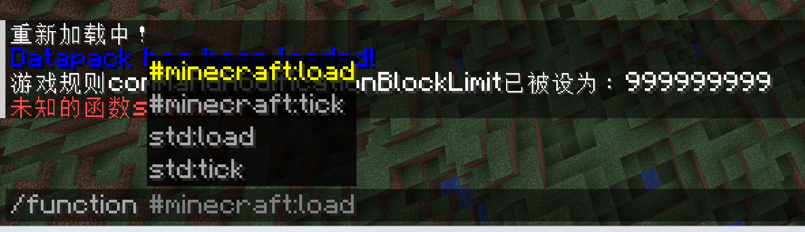
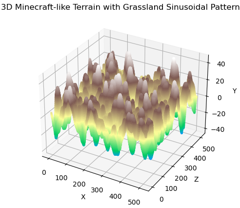
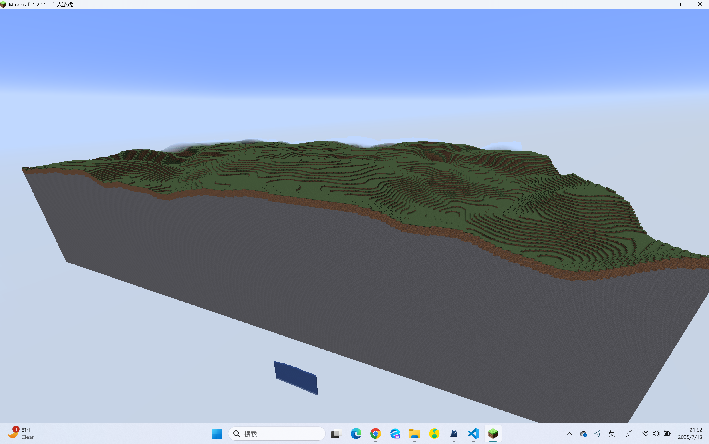
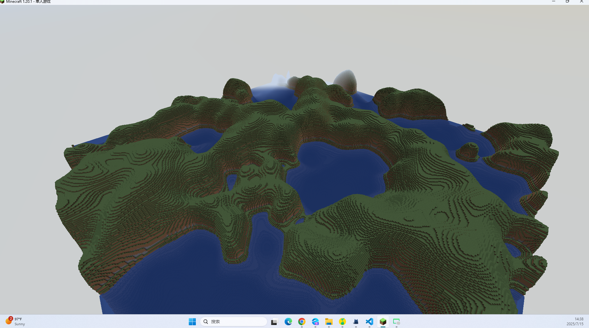
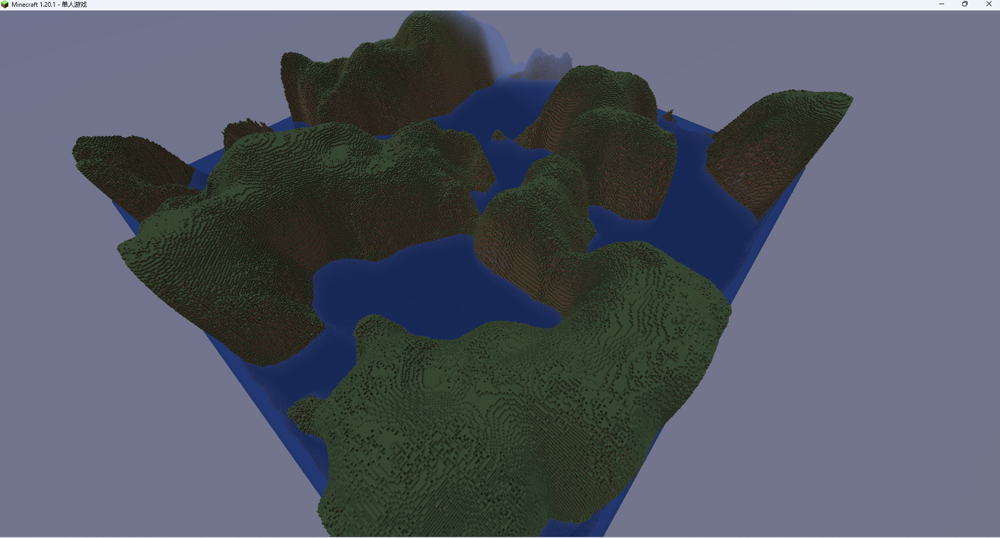
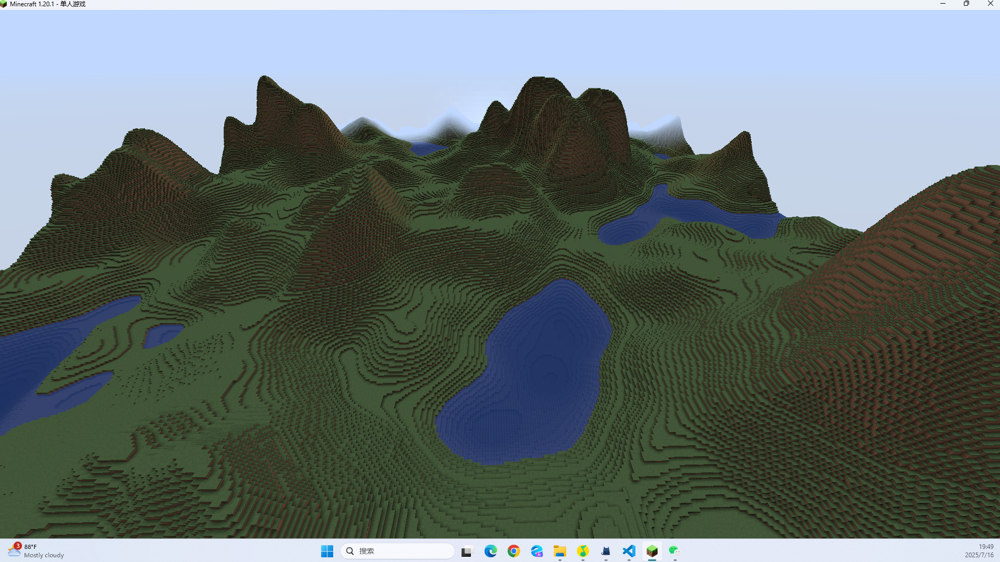

# Report
my github [repository](https://github.com/starrywiki/Terrain-Generation)
## Task1
这个task我主要实现了naive的`PerlinNoise`,最开始不太理解`lattice` `nmap`等的含义入手稍稍困难
```python
#例如nlattice指的是x/z轴方向的晶格数目，总的chunk数目应该是nlattice*nlattice
self.nlattice = lattice_size // nmap
```
后面主要是卡在如何使用minecraft正确生成地形，一开始遇到的问题是没有出现std:test
{: style="width:500px; height:auto"}
询问masterFHC得知是test里面有不合法的指令，发现是xyz坐标没有设置成整数的原因，通过把gen.py里面的噪声值int后解决问题
然后是无法重新渲染地图，我解决问题主要依靠，先清空地图， 通过手动运行：
```
/gamerule commandModificationBlockLimit 999999999
/fill 0 -64 0 512 255 512 minecraft:air
```
然后退出游戏重启游戏 再运行：
```
/reload
/gamerule commandModificationBlockLimit 999999999
/function std:test
```
此时便可正常渲染
我设置的参数为：
```python
lattice_size = 8 # in perlin.py
nmap = 64 # in perlin.py
noise = perlin.get_perlin(x, z) # in gen.py
height = int(noise * 30.0 + 5) # in gen.py
```

Task1的效果图如下：
{: style="width:700px; height:auto"}
## Task2
在这个task中我完成了用多层噪声叠加的方法来生成一片更加“层峦叠嶂”的地形，其中比较困难的是调参以及如何正确叠加噪声层
**叠加噪声层：**
  
```python
ls = lattice_size * (2**i)  # 重新设置lattice_size为第i层的2倍
nm = 512 // ls
perlin = PerlinNoise(seed=698 + i, lattice_size=ls, nmap=max(1, nm)) # 调用函数生成新的噪声层
```

然后再通过计算叠加并归一化noise即可：
```python
def get_perlin_octave(x: float, z: float, perlin_array: list) -> float:
    # Generate the 2D perlin noise with octaves
    noise = 0
    amplitude = 1.0  # 影响度
    total_amplitude = 0.0
    for octave in perlin_array:
        noise += amplitude * octave.get_perlin(x, z)
        total_amplitude += amplitude
        amplitude *= 0.5
    noise /= total_amplitude
    return noise
```
在我的gen.py中的参数设置：
```python
PerlinNoiseArray = GeneratePerlinNoiseArray(3, lattice_size=4, nmap=128) # in gen.py
noise = get_perlin_octave(x, z, PerlinNoiseArray) # in gen.py
height = int(noise * 80.0 + 5) # in gen.py
```
未使用spline Method，叠加三层柏林噪声的初步效果图：{: style="width:700px; height:auto"}
如果设置为`PerlinNoiseArray = GeneratePerlinNoiseArray(3, lattice_size=8, nmap=64)` 效果图则如下：
 {: style="width:300px; height:auto"}    {: style="width:500px; height:auto"}
然后我们考虑用上spline method，观察其变化
我分别采取了三种不一样的spline_table,分别是plain、mountain和plateau
我定义的spline方法以及预设如下：
```python
def spline(noise: float, spline_table: dict) -> float:
    keys = sorted(spline_table.keys())
    if noise < keys[0]:
        return spline_table[keys[0]]
    if noise > keys[-1]:
        return spline_table[keys[-1]]
    for i in range(len(keys) - 1):
        if keys[i] <= noise <= keys[i + 1]:
            x0, x1 = keys[i], keys[i + 1]
            y0, y1 = spline_table[x0], spline_table[x1]
            alpha = (noise - x0) / (x1 - x0)
            return lerp(y0, y1, alpha)
# 几种spline table预设
spline_table_plain = {
    -1.0: 5,
    -0.5: 15,
    0.0: 25,
    0.5: 35,
    1.0: 45,
}

spline_table_plataeu = {
    -1.0: 120,
    -0.5: 110,
    0.0: 100,
    0.5: 80,
    1.0: 60,
}

spline_table_mountain = {
    -1.0: 10,
    -0.5: 40,
    0.0: 80,
    0.5: 120,
    1.0: 150,
}
```

`spline_table_plain`:
{: style="width:500px; height:auto"}
`spline_table_plataeu`:
{: style="width:500px; height:auto"}
`spline_table_mountain`:
{: style="width:500px; height:auto"}
## Task3 (choose option1)
我分别采取了`apply_erosion` 和 `apply_peaks_and_valleys` (in utils.py)来模拟水力侵蚀以及山峰与山谷强化
### apply_erosion (水力侵蚀模拟函数)
核心思想：模拟的是自然界中最常见的地形塑造过程：水流会从高处向低处流，并带走一部分泥土，使得陡峭的山坡被冲刷得更平缓。
简化的模型是：对于地图上的每一个点，我们都检查它和它周围8个邻居的高度差。
  如果一个邻居比我低，我就认为是“水”可以从我这里流向它，于是我自己的高度就降低一点点。 
这个过程要重复很多次（iterations），就像大自然里成千上万年的侵蚀一样，最终会让尖锐的山峰变得圆润，陡峭的悬崖变成平缓的斜坡。
```python
def apply_erosion(height_map, iterations=5, strength=0.1):
    print("  Applying Erosion...")
    eroded_map = np.copy(height_map)  
    # 3x3的卷积核，代表当前点和它周围的8个邻居
    kernel = np.array(
        [[1, 1, 1], [1, 0, 1], [1, 1, 1]] 
    )

    for _ in range(iterations):
        
        neighbor_height_diffs = scipy.ndimage.convolve(
            eroded_map, kernel, mode="constant", cval=0
        )

        # 计算每个点应该流失的高度总量, 只向比自己低的邻居流失高度
        height_loss = (
            np.maximum(0, eroded_map * 8 - neighbor_height_diffs) * strength / 8
        )

        # 更新地形
        eroded_map -= height_loss

    return eroded_map
```
### apply_peaks_and_valleys (山峰与山谷强化函数)
核心思想： 让地形的“戏剧性”更强——高的山峰变得更高更尖，深的峡谷变得更深更险峻。通过一个非线性的“增强器”来实现，这个增强器会对每个点的高度进行评估：
- 如果一个点的高度远高于地形的平均水平，我们就把它再向上推一点。
- 如果一个点的高度远低于地形的平均水平，我们就把它再向下拉一点。
- 如果一个点的高度就在平均水平附近，那我们基本不动它。
```python
def apply_peaks_and_valleys(height_map, intensity):

    print("  Applying Peaks and Valleys...")
    #将高度归一化到-1到1之间
    mean_height = np.mean(height_map)
    max_deviation = np.max(np.abs(height_map - mean_height))

    if max_deviation == 0: 
        return height_map

    normalized_map = (height_map - mean_height) / max_deviation

    transformed_map = np.sign(normalized_map) * np.power(
        np.abs(normalized_map), 1 / intensity
    )

    # 将变换后的值重新映射回原来的高度范围
    new_map = transformed_map * max_deviation + mean_height

    return new_map
```
初步效果图：
{: style="width:500px; height:auto"}
经过调参后我得到更像valley&peaks的
参数设置：
```python
height = int(noise * 100.0 + 15)
height_array = apply_erosion(height_array, iterations=12, strength=2.8)
height_array = apply_peaks_and_valleys(height_array, intensity=5.0)
```
{: style="width:500px; height:auto"}
应学长的建议，我考虑在一张图上同时生成valley&peaks 以及 task2中的山脉
通过考量noise在哪个范围，生成不同的地形, noise低于`transition_start`则生成较平缓的山脉，noise大于`transition_end`则生成更陡峭的peaks&valleys，然后在中间的范围用fade，lerp平滑过渡。最后用上`apply_erosion` `apply_peaks_and_valleys` 来突出山峰的特点
```python

transition_start = 0.08  # 低于此值为山脉
transition_end = 0.63  # 高于此值为山峰

for x in range(0, x_max):
    if x % 32 == 0:
        print("x = {}".format(x))
    for z in range(0, z_max):
        noise1 = get_perlin_octave(x, z, PerlinNoiseArray)
        peaks_height = int(noise1 * 300.0)
        mount_height = int(noise1 * 60 + 13)
        if noise1 > transition_end:
            final_height = peaks_height
        elif noise1 < transition_start:
            final_height = mount_height
        else:
            alpha = (noise1 - transition_start) / (transition_end - transition_start)
            smooth_alpha = fade(alpha)
            final_height = lerp(mount_height, peaks_height, smooth_alpha)
        height_array[x][z] = int(final_height)

```
最终效果图如下：
